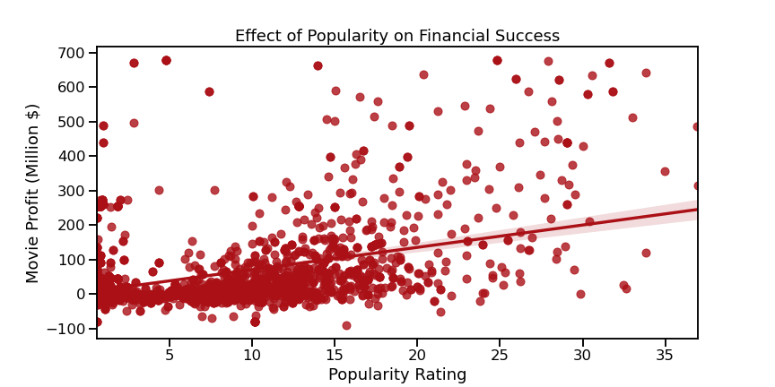

# An Analysis: Crafting a Successful Movie Studio

**Author:** Seth Schober


## Overview

As part of the Phase 1 project for Flatiron School's Data Science program, this analysis explores several essential aspects of success in the film industry through the lens of a company looking to grow into the industry with no prior knowledge. 

## Business Problem
This analysis seeks to make key determinations about the film industry that could be used as a starting point for a company looking to break into the industry. Specifically, it seeks to identify main factors that should be considered from a strategic standpoint. As a new business without industry knowledge, it is essential to dive deep into existing data to gain valuable insights. They will be discussed in depth below.

From a business perspective, this analysis is essential to creating a profitable operation sustained by positive brand reputation and popularity. 


## Data

The data used in this analysis is all publicly available through the Internet Movie Database (IMDb), Rotten Tomatoes, The Numbers, and The Movie Database (TMDb). They provide extensive historical data about movie performance, as well as reviews, ratings, producers and more. 

The data has been broken into four separate categories: general, financial, reviews, and directors. 
- General data includes names, release data, synopses and more. It comes from IMDb, RT and TN. 
- Financial data includes revenue, budget, domestic/worldwide revenue, and profit. This data comes from The Numbers. 
- Review data is composed of crowdsourced feedback. It is available from RT and TMDb. This data is especially relevant given that consumer feedback is invaluable when investigating the feasibilty of business expansion.
- Data on directors and cast is available from multiple source, though TN is used as the primary source for this analysis.

These data sources will be aggregated as relevant to provide a more comprehensive understanding than could be provided by individual sources alone.


## Methods

As a full study of the film industry is an enormous and complex topic, it is broken down into three main components. An understanding of each is a vital step towards understanding success in the film industry. 

1. Which genres are most lucrative?
2. What is the relationship between popularity and profitability?
3. How does the selection of a Director impact overall success?

In answering the first and second question, a dataset was aggregated from multiple sources that showed the financial and popular success of each movie alongside the genre. Data was also aggregated on a per-genre basis to get an understanding of the larger picture. The third question used a separate dataset showing solely past performance of directors from a financial perspective. There, unnecessary and outlier data was removed before showing the powerfully direct correlation between the selection of a Director and the overall movie success. 

## Results

With regard to the first topic of investigation -- determining which genres are most lucrative -- they were identified as Adventure, Romance, Animation and Crime, as shown in the image below. 


The results are shown relative to the *popularity* of the genres based on the findings from the second topic of investigation. There is a moderate correlation between popularity and profitability. As a result, it is essential as a company in a new market, to develop a positive brand image in order to drive future profits in a sustainable way. The popularity metrics are derived from TMDb. 




Lastly, the top five Directors were identified as Steven Spielberg, Peter Jackson, Michael Bay, James Cameron, and Christopher Nolan. Importantly, the median profitability of a film produced by one of these directors was roughly twice as high as the median profitability of a film produced by the subsequent 20 top Directors. 


In conclusion, it was determined that choice of genre has a noteworthy impact on the success of a film, and the choice of a Director has a substantial impact on success. It is recommended that business decisions take these factors into account when determining the best possible course of action.  

## For More Information

Please refer to the [Jupyter Notebook](./main.ipynb) for the full analysis, or review to the final presentation [presentation](./Presentation.pdf) for an overview of the results.

## Repository Structure

```
├── cleaning_dicts
├── data
├── images
├── README.md
├── main.ipynb
└── Presentation.pdf
```
